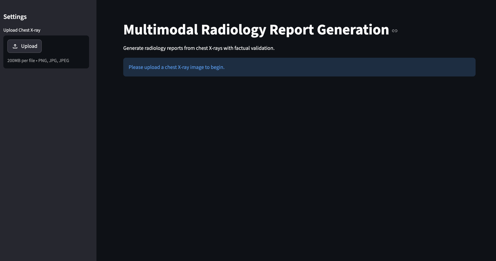
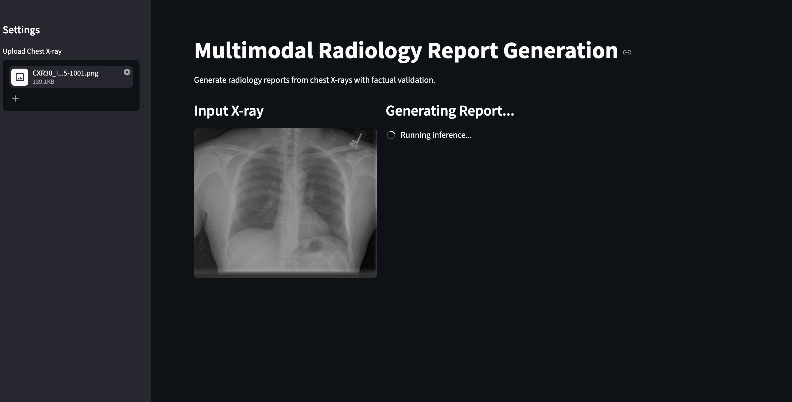
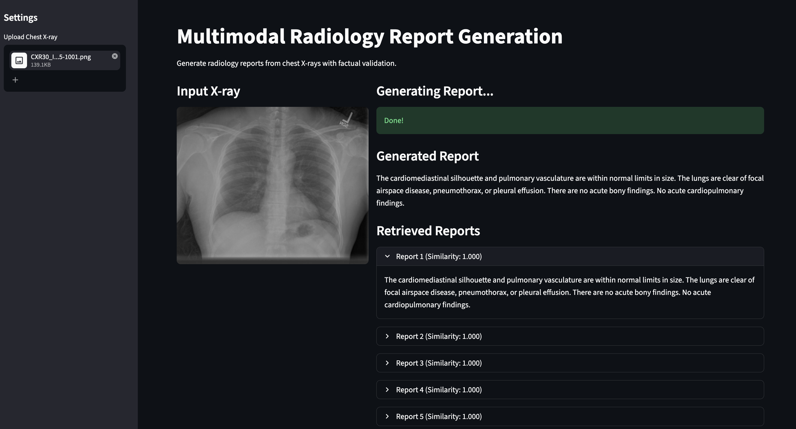

# Multimodal Radiology Report Generation

This repository implements an end-to-end multimodal deep learning system designed to generate clinically accurate radiology reports from chest X-ray images. By combining visual feature extraction with large language models and a retrieval-augmented validation pipeline, the system prioritizes factual consistency and medical reliability.

---

### Demo Preview

#### Upload Interface


#### Uploaded X-ray and Generating Report


#### Generated Report and Retrieval


## Overview

Generating radiology reports automatically requires more than just image-to-text mapping; it requires clinical accuracy. This project addresses the "hallucination" problem common in generative models by incorporating:

* **Semantic Retrieval:** Leveraging FAISS to find similar historical cases.
* **Factual Validation:** An entity-level comparison between generated text and retrieved clinical truths.

---

## Architecture

The pipeline utilizes a modular multimodal approach:

1.  **Vision Encoder:** CLIP (ViT-L/14) extracts high-level visual features (kept frozen to preserve general features).
2.  **Projection Layer:** A learned linear layer aligns visual embeddings with the language model's latent space.
3.  **Language Model:** FLAN-T5 decodes the aligned visual tokens into structured medical prose.
4.  **Verification Loop:** The output is passed through a FAISS-based retrieval system and a hallucination detection module for final clinical validation.

---

## Key Features

* **Multimodal Alignment:** Bridges CLIP (Vision) and FLAN-T5 (Language) via semantic projection.
* **Leakage Prevention:** Ensures true image-to-text generation without reliance on metadata during training.
* **Retrieval-Augmented Generation (RAG):** Uses dense embeddings to retrieve ground-truth reports for comparison.
* **Medical Entity Validation:** Detects discrepancies between generated findings and retrieved clinical data.
* **Optimized Training:** Implements mixed-precision (FP16) and efficient memory management.

---

## Performance Metrics

The model demonstrates strong semantic alignment with ground truth reports while maintaining factual consistency through retrieval-based validation.

| Metric | Score |
| :--- | :--- |
| **BERTScore (F1)** | **0.8849** |
| **ROUGE-L** | 0.2873 |
| **BLEU-4** | 0.0573 |

---

## Project Structure

```text
multimodal-radiology-report-generator/
├── dataset/                    # Image data and metadata
├── models/
│   └── multimodal_model.py     # CLIP + FLAN-T5 architecture
├── retrieval/
│   ├── build_faiss_index.py    # Embedding generation and indexing
│   └── retrieve_faiss.py       # Semantic search utilities
├── hallucination_detector.py   # Entity-level verification logic
├── dataset_loader.py           # PyTorch data pipeline
├── train.py                    # Training script
├── inference.py                # Single image generation and analysis
├── app.py                      # Streamlit web application for interactive demo
├── evaluate.py                 # Quantitative metric calculation
└── README.md
```

---

## Setup and Installation

### 1. Clone the Repository
```bash
git clone [https://github.com/jishnnuuu/multimodal-radiology-report-generator.git](https://github.com/jishnnuuu/multimodal-radiology-report-generator.git)
cd multimodal-radiology-report-generator
```

### 2. Install Dependencies
Ensure you have Python 3.9+ installed. It is recommended to use a virtual environment.
```bash
pip install -r requirements.txt
```

### 3. Data Preparation
Convert raw XML radiology reports into a structured CSV format with train, validation, and test splits:
```bash
python parse_xml.py
```

---

## Usage Guide

### Training
Train the projection layer and fine-tune the FLAN-T5 model using CLIP visual features:
```bash
python train.py
```

### Build Retrieval Index
Encode training reports and build the FAISS index to enable factual validation during inference:
```bash
python retrieval/build_faiss_index.py
```

### Inference
Generate a report for a specific X-ray image. The output includes the generated report, retrieved similar cases, and a hallucination rate analysis:
```bash
python inference.py --image_path sample_xray.png
```

### Evaluation
Compute standard NLP metrics and hallucination rates across the test set:
```bash
python evaluate.py
```

---

## Web Application (Streamlit Demo)

An interactive web interface is provided to demonstrate the full end-to-end pipeline, enabling real-time report generation, retrieval, and hallucination analysis.

### Features

- Upload chest X-ray images
- Generate radiology reports using the multimodal model
- Retrieve semantically similar reports using FAISS
- Perform hallucination detection with entity-level validation

### Run the Web App

```bash
pip install streamlit
streamlit run app.py
```
---

## Implementation Insights

* **Semantic Projection:** Multimodal alignment requires a dedicated projection layer to map visual tokens into the language space, rather than simple dimension matching.
* **Vector Search:** FAISS cosine similarity is implemented using L2 normalization and inner product for maximum efficiency.
* **Text Leakage:** The system is built to ensure no text-based metadata influences the generation, forcing the model to learn directly from visual pathology.

---

## Future Roadmap

* Fine-tuning the vision encoder on domain-specific medical datasets.
* Integration of larger multimodal architectures (e.g., BLIP-2, Flamingo).
* Incorporating region-level attention for visual explainability.
* Optimizing factual correctness using Reinforcement Learning from Human Feedback (RLHF).

---

**Author:** Jishnu Satwik Kancherlapalli
